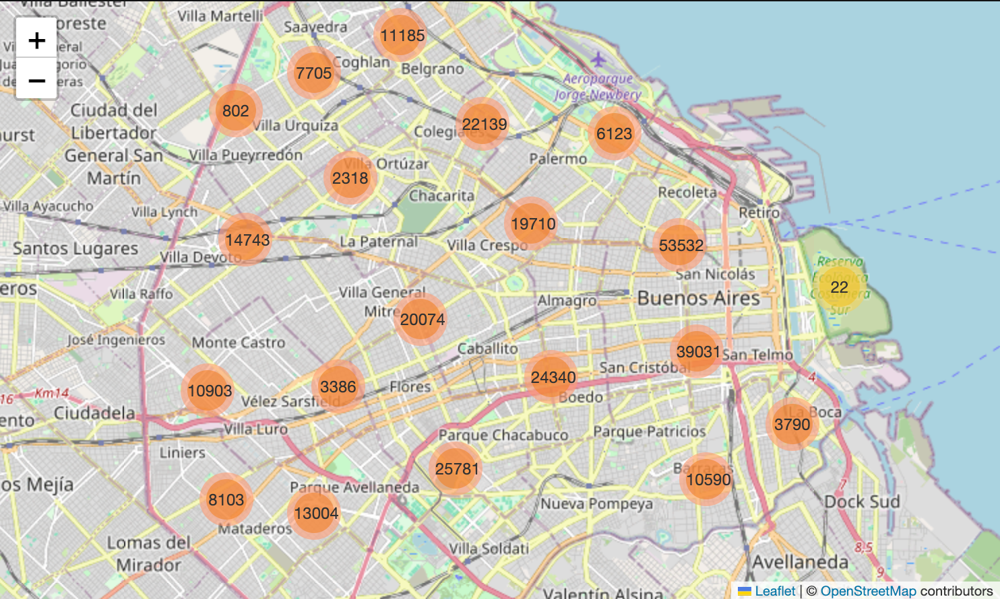
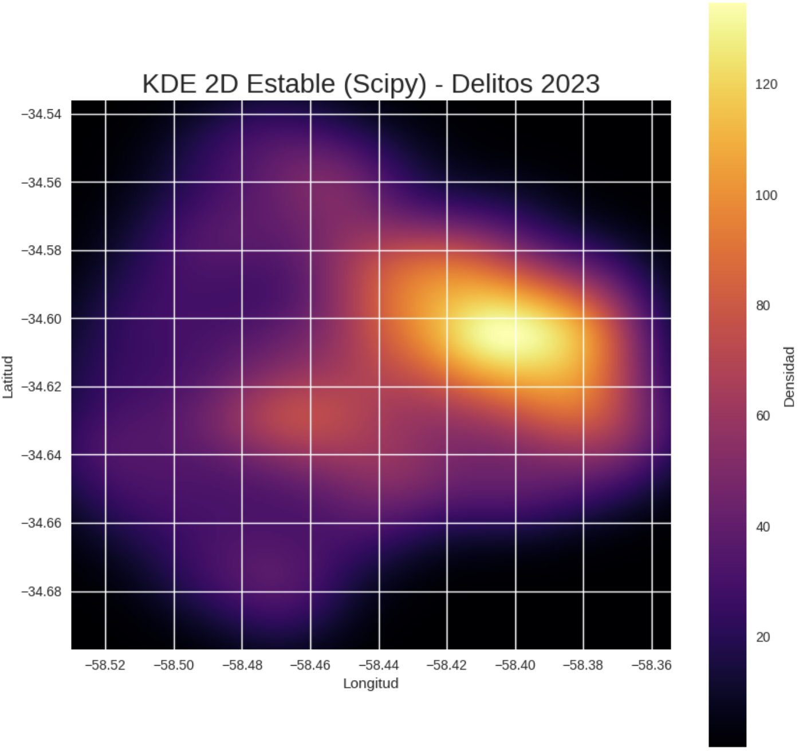
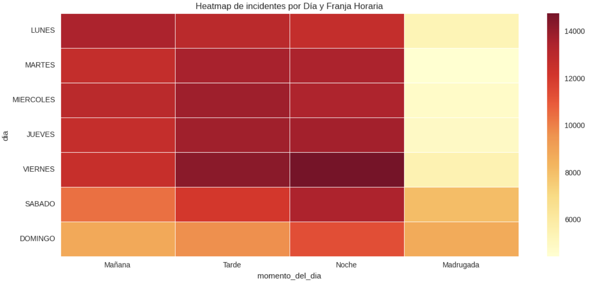
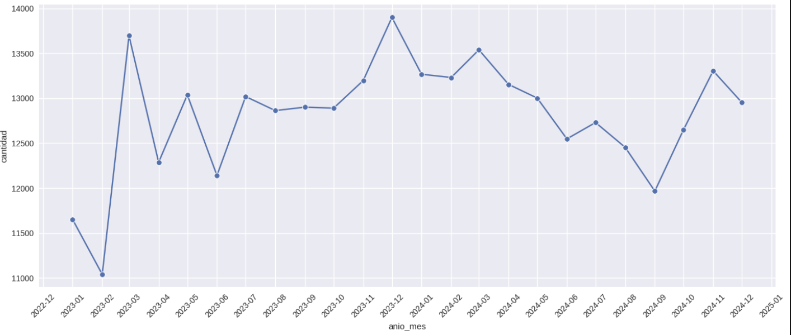

# Análisis de Delitos en CABA (2023–2024)
 
Proyecto de análisis exploratorio de datos sobre los delitos registrados en la Ciudad Autónoma de Buenos Aires durante 2023 y 2024, utilizando datos abiertos del Gobierno de la Ciudad.
 
---
 
## Pregunta de análisis
 
**¿Qué patrones temporales y espaciales pueden observarse en los delitos registrados en la Ciudad de Buenos Aires durante 2023 y 2024?**
 
---
 
## Dataset
 
**Fuente:** [Datos Abiertos GCBA](https://data.buenosaires.gob.ar/)
 
| Archivo | Registros | Período |
|---|---|---|
| delitos_2023.csv | 155.897 | Enero–Diciembre 2023 |
| delitos_2024.csv | 158.838 | Enero–Diciembre 2024 |
| **Total** | **314.735** | **2023–2024** |
 
**Variables disponibles:** id, año, mes, día, fecha, franja horaria, tipo, subtipo, uso de arma, uso de moto, barrio, comuna, latitud, longitud, cantidad.
 
---

## Principales hallazgos
 
### Distribución por tipo de delito
Robo y Hurto concentran aproximadamente el 80% de los delitos registrados en ambos años. Los robos aumentaron un 5% entre 2023 y 2024 (64.983 → 68.392), mientras que los hurtos se mantuvieron estables.
 
### Patrones temporales
- Los **viernes por la tarde y la noche** concentran la mayor cantidad de incidentes de la semana.
- Los **fines de semana** muestran volúmenes notablemente menores que los días hábiles, especialmente en la madrugada del domingo.
- El mes de **diciembre de 2023** registró el pico más alto de la serie (≈13.900 delitos), seguido por marzo de 2024.
### Distribución espacial
- La mayor concentración de delitos se ubica en el **centro-norte de la ciudad**, con epicentro en la zona de Retiro / San Nicolás (53.532 registros en el período).
- **Palermo, Balvanera y Flores** lideran entre los barrios con más incidentes.
- El KDE 2D muestra una concentración densa alrededor de las coordenadas (-34.60, -58.40), correspondiente al microcentro y sus alrededores.
- Las zonas periféricas del sur y oeste presentan densidades significativamente menores.
---

## Visualizaciones

---------------------------------------------------

Mapa de delitos por barrio




---------------------------------------------------

Concentración espacial de delitos



---------------------------------------------------

Patrones temporales por día y franja horaria




---------------------------------------------------

Evolución mensual de delitos




---
 
## Tecnologías utilizadas
 
| Librería | Uso |
|---|---|
| Pandas | Carga, limpieza y transformación de datos |
| NumPy | Operaciones numéricas |
| Matplotlib / Seaborn | Visualizaciones estáticas |
| Scipy | KDE 2D para el heatmap espacial |
| Folium | Mapa interactivo por barrio |
| Google Colab | Entorno de desarrollo |
 
---
 
## Estructura del repositorio
 
```text
analisis-delitos-caba/
│
├── analisis_delitos_caba.ipynb   # Notebook principal
├── delitos_2023.csv              # Dataset 2023 (155.897 registros)
├── delitos_2024.csv              # Dataset 2024 (158.838 registros)
├── README.md
└── images/
    ├── mapa_barrio.png
    ├── heatmap_espacial.png
    ├── heatmap_temporal.png
    └── evolucion_temporal.png
```
 
---
 
## Etapas del proyecto
 
1. **Exploración inicial** — carga, inspección de variables y estadísticas descriptivas
2. **Limpieza** — tratamiento de valores faltantes, duplicados y corrección de tipos
3. **Transformación** — creación de variables derivadas (franja horaria, momento del día, año-mes)
4. **Visualización** — mapas, heatmaps, series temporales y distribuciones por tipo
---
 
## Autor
 
**Mariano Nieto**
Proyecto realizado para la materia Introducción al Análisis de Datos — UTN FRH
